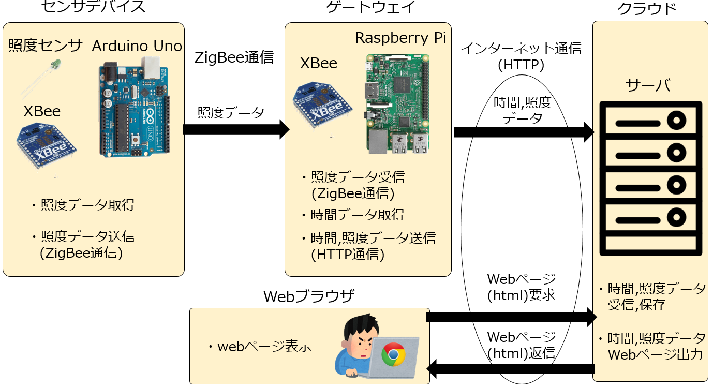
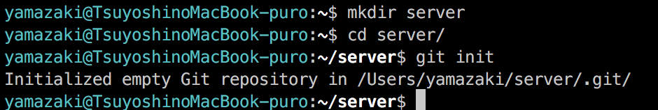
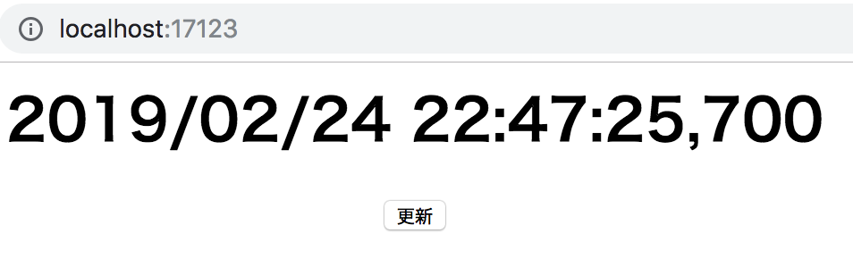
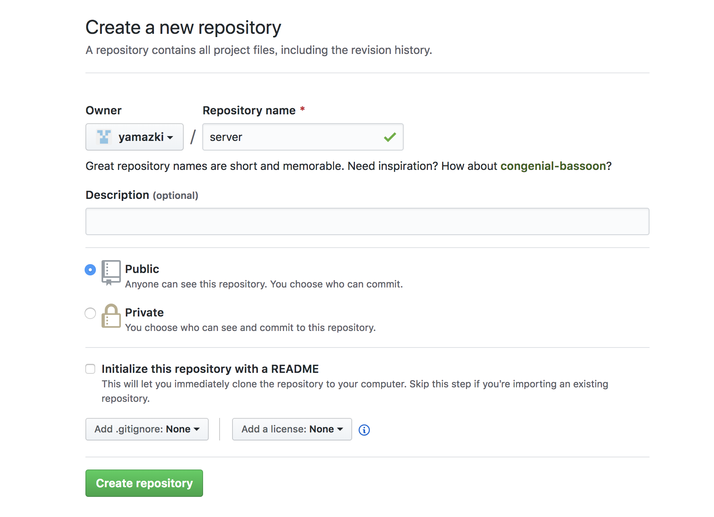
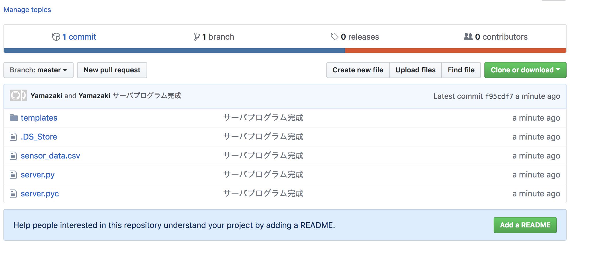
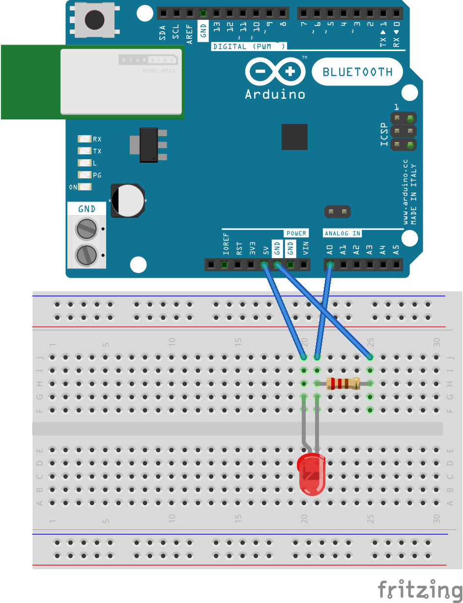
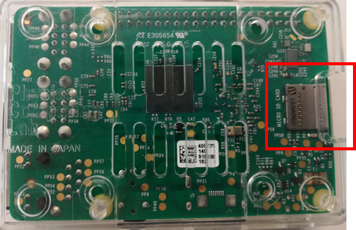
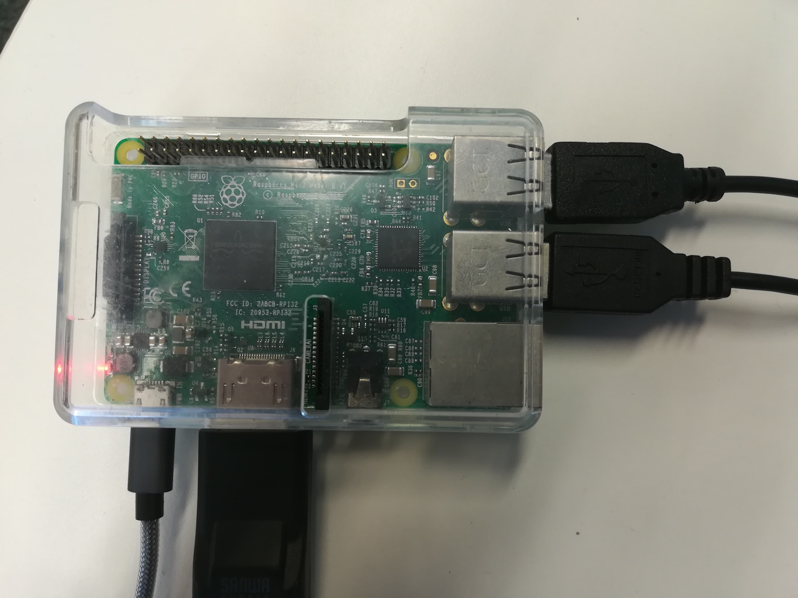
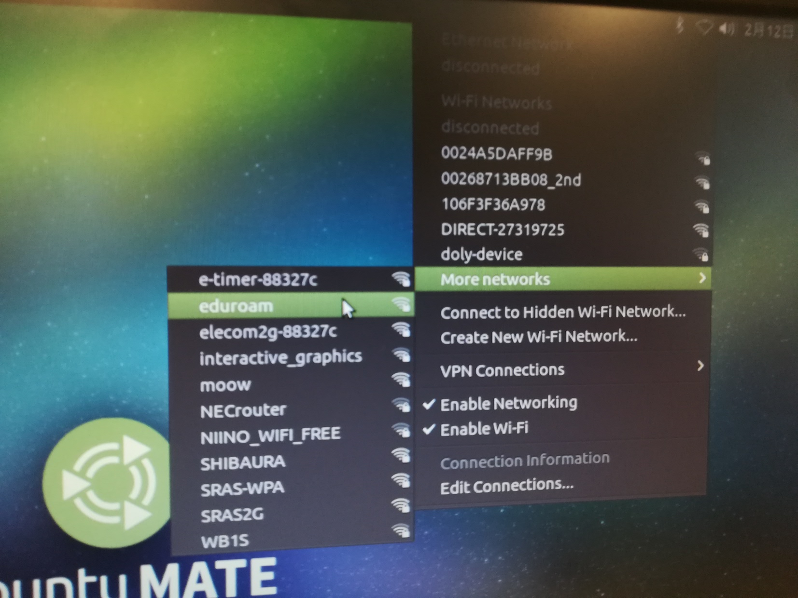
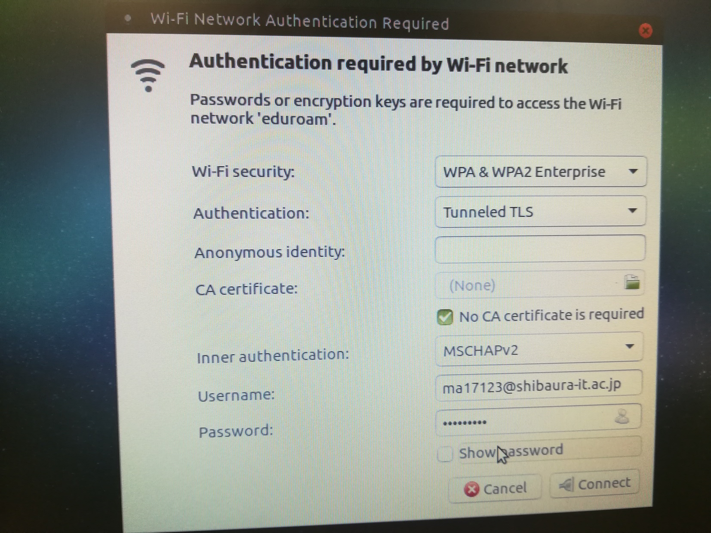

<div style="text-align: center;">
<br/><br/>
<br/><br/>
<br/><br/>
<br/><br/>
<br/><br/>
<br/><br/>
<br/><br/>
<font size = "7">
照度データWeb表示システム<br/><br/>
構築手順書
</font>
</div>
<css>


<!-- Markdown PDF(Vscodeプラグイン) における改ページ-->
<div style="page-break-before:always"></div>

# 本手順書の目的
本手順書は,照度データWeb表示システムというIoTシステムを構築することにより,  
IoTシステムの構築方法を理解することを目的としている.

# 照度データWeb表示システム概要
## システム構成
照度データWeb表示システムの構成図を以下に記す.



## 機能
また,照度データWeb表示システムは以下の機能を持つ.

- 照度データ保存機能
  - センサデバイスの照度センサを用いて照度データを取一定間隔で取得,  
    ZigBee通信でゲートウェイに送信.
  - ゲートウェイでセンサデバイスからの照度データを受信,  
    現在の時間情報を付加してHTTP通信で照度データをクラウドに送信.
  - クラウドで時間と照度データを受信,ファイルに保存.

- 温度データ表示機能
  - ブラウザからサーバにHTTP通信でhtmlを要求.
  - html上のJavaScriptが実行,時刻と照度データを表示.
  - ブラウザで更新ボタンをクリックすると,時刻とp照度データを更新

<div style="page-break-before:always"></div>

# 事前準備
このIoTシステムを構築するにあたり,以下のソフトウェアのインストールなどが必要である.  

- GitのインストールおよびGitHubへの登録
- cURLのインストール
- Pythonのインストール
- Visual Studio Codeのインストール
- eduroamの登録
- Arduino IDEのインストール
- X-CTUのインストール
- ブラウザのインストール

以下,それぞれの概要とインストール方法などを記述する.

# GitのインストールおよびGitHubへの登録

## Gitについて
Gitとはプログラムのソースコードなどを管理する分散型のバージョン管理ツールである.
バージョン管理ツールとは,編集されるファイルの変更履歴を管理するためのシステムである.
また,Gitのクラウドサービスを提供する[Github](https://github.com)や[BitBucket](https://bitbucket.org/)が存在する.

### Gitの使い方
Gitを用いたソフトウェアのバージョン管理の方法を簡単に説明する.  
まず,Gitのインストールを行う.
以下のurlから,自分のPCのOSとあっているものを選択,インストールする.  

https://git-scm.com/downloads  

インストールが終了したら,ターミナルやコマンドプロンプトなどで自分のソースコードを編集しているディレクトリのルートディレクトリに移動する.
そのディレクトリで以下のコマンドを入力する.

```
git init
```

このコマンドを入力すると, .gitディレクトリが作成され,このディレクトリが作成されたディレクトリ下のファイルのバージョン管理を行うことができる.  

次に,Gitのコミット(変更履歴の登録)を説明する.
Gitのコミット方法としては,プロジェクト内のファイルの追加・変更後,
以下のコマンドを入力し.

```
git add .
```
<div style="page-break-before:always"></div>

さらに,以下のコマンドを入力することで
gitに変更履歴が記録される

```
git commit -m "コミットメッセージ"
```

コミットメッセージには変更した内容を記述する.  
例えば,

```
git commit -m "ユーザ認証機能を追加"
git commit -m "問題になっていたバグXXを修正"
```

といった風に記述を行う.

#### まとめ

Gitでのプロジェクト管理方法は

1. git init (1回だけ)
2. プロジェクト内のファイル内容の追加・変更を行う.
3. git add .
4. git commit -m "コミットメッセージ"
5. 2 ~ 4 を繰り返す

となる


## GitHubについて
次に,GitHubの説明をする. 
GitHubとはgitのプロジェクトをクラウド上に保存できるサービスであり,
多種多様なOSSの開発がGitHub上で行われている.
本手順書ではこのサービスを利用してプログラムの管理とデプロイを行う.

### GitHubへの登録
以下のurlからGitHubのサイトへいき,Sing Upをクリック  
https://github.com/  

GitHubにアカウントを登録する.

また,GitHubには二種類のリポジトリがあり,それぞれの特徴を記す.

- パブリックリポジトリ  
  自分以外も閲覧可能なリポジトリ  
  自分以外にプロジェクトを公開したい時に使う.

- プライベートリポジトリ  
  自分と自分が認可した人以外は閲覧が不可能なリポジトリ  
  パブリックリポジトリでは困る時,例えばパスワードなどをソースコード内に含めるときに使用する.


# cURLのインストール
## cURLとは
cURLとはさまざまなプロトコルを用いてデータを転送するライブラリとコマンドラインツールを提供するプロジェクトであり,  
本手順書ではHTTP通信のテストのために使用する. 

## インストール方法
MacOSやLinuxでは標準でインストールされている.
Windowsの場合にはWindows10であれば,  
Windows 10 Ver.1803（RS4）のプレビュー版、Build 17063からならば,
標準でインストールされているのでインストール不要である.

インストールされているかどうかの確認方法としては,

- MacOS,Linuxの場合,ターミナルで
  ```
  which curl
  ```
  と入力し,パスが表示されればインストールされている.


- Windowsの場合,コマンドプロンプトか,パワーシェルで
  ```
  Where curl
  ```
  と入力し,パスが表示されればインストールされている.  

インストールされていない場合には, ここ https://curl.haxx.se/download.html からダウンロードし,インストールする.


# ブラウザのインストール
JavaScriptが正常に動作しない可能背があるので,  
Internet Explorer**以外**をインストールする.  
インストールされている場合は,最新版にアップデートする.

<div style="page-break-before:always"></div>

# Pythonのインストール
## Pythonとは
Pythonとはスクリプト言語という種類の言語であり,C言語やJavaで必要であったコンパイルが不要である.
また,動的型付けという実行時に型を決定方式を利用しているため,変数や関数の型宣言が不要である(型が存在しないという訳ではない).
現在,PythonにはPython2とPython3が存在するが,Python3が最新版のPythonであるためPython3の方を利用する.

## インストール方法
公式サイト(https://www.python.org/downloads/)から自分のPCに適したpython3をダウンロード.  
ダウンロードするバージョンは最新版(執筆時(2019/2/17)の最新版はPython3.7.2)をダウンロードする.

## pip3について
pip3というpython3のパッケージマネージャ(インストールやアンインストールなどのソフトウェアの管理を行うものである.
pip3ならばpython3モジュールの管理を行う)があり,これを利用してIoTシステム構築に必要なpython3モジュールをインストールする.


# Visual Studio Codeのインストール
Visual Studio Codeはソースコードを記述するためのエディタである.  
Emacsやviなどのエディタも存在するが,これらは扱いにくいため,  
Visual Studio Codeを使用する. 
以下のurlからインストールする.  
https://code.visualstudio.com/

<div style="page-break-before:always"></div>

# eduroamの登録
eduroamとは,複数の大学が共同で提供しているWi-Fi通信サービスである.
本手順書では,[さくらインターネット](https://www.sakura.ad.jp/)という外部のVPSを利用するが,
SRASではネットワークに制限がかかっているためさくらインターネットに接続ができない.
そこで,本手順書では[eduroam](http://www.sic.shibaura-it.ac.jp/indexBOX/info/20111223.html)というネットワークに制限がないWi-FWサービスを利用することにより,さくらインターネットに接続する.

# Arduino IDEのインストール
センサデバイスで使用するArduino Unoにプログラムを書き込むために,  
必要なソフトウェアであるArduino IDEを以下のurlからダウンロードし,インストールする.  
https://www.arduino.cc/en/main/software  


# X-CTUのインストール
センサデバイスとゲートウェイの間の通信にZigBee通信を用い,  
ZigBee通信を行うための通信機器として,XBeeを利用する.  
このXBeeの設定をするためのソフトウェアがX-CTUである.以下のurlからダウンロードし,インストールする.
https://www.digi.com/products/iot-platform/xctu#resources

<div style="page-break-before:always"></div>

# 構築手順
本手順書では,以下の手順でシステムを構築していく.  

1. サーバプログラムの作成  
2. センサデバイスの作成
3. ゲートウェイの作成
4. センサデバイスとゲートウェイの通信

# 1. サーバプログラムの作成

## 1.1 サーバプログラムプロジェクト初期化
サーバサイドのプログラムプロジェクトであるserverディレクトリを作成.  
serverディレクトリを作成後,git init コマンドを入力しプロジェクトを初期化する.  
以下にこの手順のコマンドの入力を記す.

```
mkdir server
cd server/
git init
```

入力例


## 1.2 Flaskインストール
次にサーバプログラムで使用する[**Flask**](http://flask.pocoo.org/)というフレームワークをインストールする.  
Flaskとは,pythonを用いたRESTful APIの開発を容易にするフレームワークである.  

### インストール方法

```
pip3 install flask
```

上記のコマンドを入力すればインストールできる.

<div style="page-break-before:always"></div>
## 1.3 サーバプログラム作成
次に,センサデータの受信とブラウザへのセンサデータの表示を行うプログラム,server.pyを作成する.  
server.pyの内容を以下に記す.  

server.py
```python
from flask import Flask, request, render_template
app = Flask(__name__)
file_path = "./sensor_data.csv"
my_port = 17123

@app.route('/', methods=['GET'])
def get_html():
  return render_template('./index.html')
  
@app.route('/lux', methods=['POST'])
def update_lux():
  time = request.form["time"]
  lux = request.form["lux"]
  try:
    f = open(file_path, 'w')
    f.write(time + "," + lux)
    return "succeeded to write"
  except Exception as e:
    print(e)
    return "failed to write"
  finally:
    f.close()

@app.route('/lux', methods=['GET'])
def get_lux():
  try:
    f = open(file_path, 'r')
    for row in f:
      lux = row
    return lux
  except Exception as e:
    print(e)
    return e
  finally:
    f.close()

if __name__ == '__main__':
    app.run(debug=True, host='0.0.0.0', port=my_port)
```

<div style="page-break-before:always"></div>

また,templatesというディレクトリを作成し,その下に以下のindex.htmlを作成する.

index.html
```html
<title>テストアプリ</title>
<html>
  <head>
    <script>
      const updateLux = async(url, element) => {
        const sensorData = await fetch(url)
                                 .then(response => response.text())
        const target = document.getElementById(element)
        target.innerHTML = `<h1>${sensorData}</h1>`
      } 
    </script>
  </head>
  <center>
  <body onLoad="updateLux('/lux', 'data')">
    <div id = "data">test</div>
    <inPOST type="button" value="更新" onclick="updateLux('/lux', 'data')">
  </body>
  </center>
</html>
```

このプログラムは ```python3 server.py```とコマンドを入力することで実行でき,  
実行に成功すると以下の出力が表示される.

```
 * Serving Flask app "server" (lazy loading)
 * Environment: production
   WARNING: Do not use the development server in a production environment.
   Use a production WSGI server instead.
 * Debug mode: on
 * Running on http://0.0.0.0:17123/ (Press CTRL+C to quit)
 * Restarting with stat
 * Debugger is active!
 * Debugger PIN: 216-426-961
```

また,この作業が終了した時のディレクトリ構成は以下のようになる.

```
server
├── server.py
└── templates
    └── index.html
``` 

<div style="page-break-before:always"></div>
## server.py解説  
server.pyの解説を機能と部分ごとにしていく.

## プログラムの機能
このプログラムは以下の機能を持つ.

  - ルートパスにGETメソッドでアクセスするとindex.htmlをリターン
  - /luxパスにGETメソッドでアクセスすると,sensor_data.csvのファイル内容(時間,照度値)をリターン
  - /luxパスにPOSTメソッドと時間と照度値のパラメータを添付してアクセスすると,  
    sensor_data.csvにその内容を**上書きで**書き込む

それぞれについて,プログラムの部分ごとに説明していく

<br>

### 変数定義部分
```python
from flask import Flask, request, render_template
app = Flask(__name__)
file_path = "./sensor_data.csv"
my_port = 17123
```
この部分では,以下の定義を行なっている.

- Flaskで使用するモジュールのインポート
- センサデータを保存するファイルパス(file_path)の定義 
- プログラムが使用する[ポート番号](https://ja.wikipedia.org/wiki/%E3%83%9D%E3%83%BC%E3%83%88%E7%95%AA%E5%8F%B7)(my_port)の定義  

また,my_portの数字は0~65535の中から,0~1023**以外**の数字を使用する.  
理由としては,これらの番号はウェルノウンポート番号と呼ばれるポート番号であり,
使用するには管理者権限が必要なためである.
なので,my_portの番号は自分の学籍番号ALXXXXXのXXXXXの部分を使用すると良い.  


<div style="page-break-before:always"></div>
### htmlリターン部分
``` python
@app.route('/', methods=['GET'])
def get_html():
  return render_template('./index.html')
```

この部分では,ルートパスにHTTPのGETメソッドでアクセスされた場合に,index.htmlを返すコードを記述している.  
このプログラムでは,ブラウザからlocalhost:17123(17123はmy_portの番号)にアクセスすると,  

1. サーバはindex.htmlをブラウザにリターン
2. ブラウザはindex.htmlの内容を解釈し表示
3. 最終的に以下のような画面がブラウザに出力される.  
    
  (この前に,`curl -X POST -d "time=2019/02/24 22:47:25&lux=700" localhost:17123/lux`とコマンドを入力し,sensor_data.csvファイルを作成させる)
  カンマ区切りで左が時刻,右が照度値である.

という順番に処理される.

<div style="page-break-before:always"></div>
### センサデータ受信部分
```python
@app.route('/lux', methods=['POST'])
def update_lux():
  try:
    time = request.form["time"]
    lux = request.form["lux"]
  except Exception as e:
    return "paramater is incorrect"

  try:
    f = open(file_path, 'w')
    f.write(time + "," + lux)
    return "succeeded to write"
  except Exception as e:
    print(e)
    return "failed to write"
  finally:
    f.close()
```

この部分は,ゲートウェイからのセンサデータをHTTPのPOSTメソッドで受け取り,  
CSVファイルに保存する処理である.  

サーバが起動している状態で,以下のcURLコマンドを入力

```
curl -X POST -d "time=2019/02/24 22:47:25&lux=700" localhost:17123/lux
```

すると,server.pyと同じディレクトリにsensor_data.csvファイルが作成され(すでに存在する場合は更新),  
時間と照度のデータが保存される.  
上記のcURLコマンドの場合だと,以下のファイル内容になる.

sensor_data.csv
``` 
2019/02/24 22:47:25,700
```

1列目が時刻,2列目が照度値である. 

<div style="page-break-before:always"></div>
### 照度データ取得部分
```python
@app.route('/lux', methods=['GET'])
def get_lux():
  try:
    f = open(file_path, 'r')
    for row in f:
      lux = row
    return lux
  except Exception as e:
    print(e)
    return e
  finally:
    f.close()
```

この部分では,localhost:17123/lux にHTTPのGETメソッドでリクエストを送ると,  
sensor_data.csvに書き込まれている時間と照度データを返信するプログラムである.

例えば, 以下のcURLコマンドを入力すると

```
curl localhost:17123/lux
```

以下の内容が返信され,表示される.

```
2019/02/24 22:47:25,700 
```

本手順書ではこれを利用して,ブラウザに照度データの表示を行う.

<div style="page-break-before:always"></div>
## index.html解説  
index.htmlの解説を行う.

index.htmlの下記の部分の解説を行う.
```html
<body onLoad="updateLux('/lux', 'data')">
  <div id = "data">test</div>
  <input type="button" value="更新" onclick="updateLux('/lux', 'data')">
</body>
```

onLoadはhtmlが読み込まれた時に実行される関数を登録し,  
onClickはボタンがクリックされた時に実行される関数を登録する.  

つまり,このhtmlは読み込み時とボタンがクリックされた時にupdateLuxの関数を実行する.

次に,updateLuxの内容を記述している,index.htmlのJavaScripの部分の解説を行う.


``` html
  <script>
  const updateLux = async(url, element) => {
    const sensorData = await fetch(url)
                              .then(response => response.text())
    const target = document.getElementById(element)
    target.innerHTML = `<h1>${sensorData}</h1>`
  } 
  </script>
```

この部分では,urlとelementを引数とし,urlからセンサデータを取得が,elementの内容を変更する関数である.  

html内での使われかたで解説すると,  
urlは/luxなので,この関数は,localhost:17123/lux にGETメソッドでアクセスし, 
時間と照度データの内容を取得し,sensorDataに代入する.
その後,elementの内容,つまりdataエレメント(```<div id = "data"></data>```で囲まれた部分)の内容をsensorDataの内容に書き換えるものである.

<div style="page-break-before:always"></div>
### 最終結果
最終的に,この手順を終えると,以下のディレクトリ構成になっている.

```
server
├── sensor_data.csv
├── server.py
└── templates
    └── index.html
``` 
### GitとGitHubへの登録
また,この作業内容をGitとGitHubに保存する.
serverディレクトリで以下のコマンドを入力

```
git add . 
git commit -m "サーバプログラム完成"
```

その後ブラウザで,GitHubにログイン,  
Sterat a project をクリック,  
以下の画像の内容を入力し,Create repositoryをクリック.



クリック後,いくつかの作業内容が記述されているので,
その中の,  
…or push an existing repository from the command line 下に記されている作業内容のコマンドを実行.  
入力すると,GitHubのアカウントとパスワードの入力が求められるので入力.  
入力後,ページを更新すると,以下ようなの画面になっている.  



この手順を踏むことにより,GitHubへのプロジェクトの登録が完了する.

以後,このプロジェクトのコードを変更した場合には,  


```
git add .
git commit -m "変更内容" 
```

とコミットした後に,

```
git push
```
とすれば,GitHubへのプロジェクトの変更内容を保存することができる.

### サーバへのデプロイ
サーバにログインし,git,python3,Flaskをインストールした後に,

```
git clone プロジェクトのURL
```

と入力すると,プロジェクトがダウンロードできるので,serverディレクトリに移動後  
`python3 server.py`と入力すると,サーバプログラムが起動できる.


<div style="page-break-before:always"></div>


# センサデバイス作成
次に,センサデバイスのプログラムとハードを作成する.  
センサデバイスの作成に必要なハードを以下に記す.

- Arduino Uno
- Arduino Uno用XBeeシールド
- ジャンパー線
- ブレッドボード
- 照度センサ
- １KΩの抵抗

## 2.1 Arduino動作確認
センサデバイスを構築するにあたりまず,  
Arduinoの動作の確認を行う.  
Arduino IDEを起動し,以下のプログラムを記述する.

```arduino
void setup() {
  // シリアルポートを開き，通信速度を9600bpsに設定
  Serial.begin(9600); 
}

void loop() {
  // 1000ms(1秒待ち)
  delay(1000);

  // シリアル通信でtestを改行ありで出力(改行なしの場合はSerial.print)
  Serial.println("test");
}
```

その後,このプログラムをArduino Unoに書き込み,正しく動作しているかを確認する.  
手順としては以下のようになる.

1. ツール -> ボード　をArduino Unoに選択
2. ツール -> シリアルポートで Arduino Unoを選択
3. 右矢印ボタンをクリックしてArduino Unoにプログラムを書き込む
4. ツール -> シリアルモニタをクリックし,testが1秒ごとに出力される

上記の動作が確認できたら,センサデバイスの回路の作成に移る.

## 2.2 センサデバイス回路作成
回路を作成する前に,Arduino Unoに Arduino Uno用XBeeシールドを装着する,  
今の段階ではXBee用シールドは必要ないが,あとで装着する必要があるので今のうちに装着しておく.

Arduinoとブレッドボードに以下の図のように,照度センサとジャンパー線と照度センサを用いて回路を作成する.
 


この回路が作成できたら,以下のプログラムをArduinoに書き込む

```arduino
int lux = 0; 
void setup() {
  Serial.begin(9600); //モニターに出力するための設定
}
void loop() {
  lux = analogRead(0);
  Serial.println(lux); //入力された値をモニターに出力
  delay(1000);
}
```

このプログラムを書き込み,シリアルモニタを開くと,照度値が1秒間隔で取得される.  
正しく取れているかの確認方法としては,照度センサは明るいと値が大きくなり,暗いと値が小さくなるので  
手をかざしてみるなどしてみてこの通りに値が変化するかどうかを確認すると良い.  

以上でセンサデバイスの作成を終了する.

<div style="page-break-before:always"></div>

# ゲートウェイの作成
## 3.1 Raspberry Piのセットアップ
次に,ゲートウェイの作成を行う.

### ディスクイメージの書き込み
Raspberry PiはSDカードにOSのディスクイメージを書き込み,それを読み込ませることで利用できる.  

セットアップ手順としては,  
まず,Raspberry Pi にインストールするOSをダウンロードする.  
公式の推奨OSはRaspbianだが,このOSはeduroamへの接続設定が面倒であるため,  
[Ubuntu MATE](https://ubuntu-mate.org/)というOSを利用する.  
次のサイトからUnubntu MateのRaspberry Pi用イメージをダウンロード  
Ubuntu MATE: https://ubuntu-mate.org/download/  
ダウンロード後解凍し,  
解凍されたイメージをSDカードに書き込むことができるソフトウェアを利用してSDカードにダウンロードしたイメージを書き込む.

- windowsの場合  
  win32diskimagerというソフトウェアを利用  
  https://sourceforge.net/projects/win32diskimager/

- MacOSの場合  
  Etcherというソフトウェアを利用  
  https://www.balena.io/etcher/


SDカードへの書き込み後,Raspberry Pi裏にSDカードを挿入
場所は以下である.
 


<div style="page-break-before:always"></div>  
SDカード挿入後,
Raspberry Piに以下のように電源,HDMIケーブル,キーボード,マウスを接続すると,  
Raspberry Piが起動する.

 

起動後,以下のように設定を行なっていく.  

- 言語選択　-> 一番下にある日本語を選択
- 無線 -> Wi-fiネットワークに今すぐには接続しないを選択
- どこに住んでいるか -> 東京
- キーボードレイアウト -> 日本語 日本語
- 名前,パスワード -> 自分の情報を入力

以上の項目を入力すると設定が終了しUbuntu MATEが起動する.  

起動後,Wi-fiの設定を行う.  
右上のWi-fiアイコンをクリックし,eduroamを選択.
表示されない場合は,More networksをクリックする.

 

また,eduroamの設定は以下の様に行う.
 

最後に,エディタのインストールを行う,
ここでは,Emacsを使用する.  
以下のコマンドでインストールできる.

```
sudo apt install emacs
```

ちなみに,aptはDebian系Linuxのパッケージマネージャであり,  
emacs以外にも様々なソフトがインストールできる.  

<div style="page-break-before:always"></div>  

## 3.2 Arduino Unoとのシリアル通信
次に,Arduino UnoとRaspberry Piでシリアル通信を行うことにより,Arduinoから照度データの受信を行う.  
そのためのプログラムをpython3で作成し,Raspberry Pi上で実行させる.    
python3でシリアル通信を行うためにはPySerialというモジュールが必要なので,以下のコマンドでインストールする.

```
pip3 install pyserial
```

次に,Arduino UnoとRaspberry PiをUSBケーブルで接続し,  
以下のgateway.pyを作成する.

```python
import serial

ser = serial.Serial('/dev/ttyACM0', 9600, timeout=10)

# 最初に受信されるデータは値がおかしいのでスルー
is_first = True

while True:
  lux = ser.readline().decode('utf-8')
  if is_first:
    is_first = False:
  else:
    print(lux)
ser.close()

```

作成後,このプログラムを実行させるが,シリアル通信を行うためには管理者権限が必要なので  
コマンドの前に`sudo`をつける.  
つまり,以下のようなコマンドを入力する必要がある.

```
sudo python3 gateway.py
```

正しく動作すると,シリアルモニタと同様にターミナルに照度値が表示される.

<div style="page-break-before:always"></div>  

## 3.3 ゲートウェイとサーバの通信
次に,照度データをサーバに送信する.  
これは,今までcURLコマンドでおこなってきたものプログラムに置き換えれるものである.  
先ほど作成したgateway.pyを以下のコードに変更する.

```python
import serial
import datetime
import requests

ser = serial.Serial('/dev/ttyACM0', 9600, timeout=10)

data = {}

# 最初に受信されるデータは値がおかしいのでスルー
is_first = True

while True:
  now = datetime.datetime.now().strftime('%Y/%m/%d %H:%M')
  lux = ser.readline().decode('utf-8').splitlines()
  data['time'] = now
  data['lux'] = lux
  if is_first:
    is_first = False
  else:
    print(data)
    # 17123の部分はserver.pyのmy_portにする
    response = requests.post('http://160.16.210.86:17123/lux', data=data)
    print(response)
ser.close()
```

このプログラムを実行させると,
照度値と現在の時間がサーバに送信される.  
正しく動作しているならば,Raspberry Piには1秒ごとに時間と照度値および  
200のHTTPレスポンスステータスコードが,サーバにはアクセスログが出力される.  
また,htmlをブラウザで確認すると,Raspberry Piと同様の時間と照度値が表示される.

以上で,ゲートウェイとサーバの通信の作成は終了である.


<div style="page-break-before:always"></div>  

##  3.4 Arduino Unoとゲートウェイの通信
最後に,シリアル通信をZigBee通信に置き換える.

<div style="page-break-before:always"></div>  


# 付録
## node.js を利用したサンプルプログラム
本章では,[node.js](https://nodejs.org/ja/)というサーバーサイドJavaScriptを利用したプログラムのサンプルを記載する.  
node.jsの使い方

1. 公式サイトでnode.jsをインストールする
2. ターミナルを起動,mkdirなどでプロジェクトディレクトリの作成
3. プロジェクトのルートディレクトリに移動
4. npm init というコマンドを入力し,プロジェクトの初期化を行う

上記の手順を行うことにより,node.jsアプリケーションを開発する準備が完了する.

また,手順書のサーバプログラムserver.pyをnode.jsのプログラムに置き換えたserver.jsを以下に記す.  

また,このプログラムはexpressというフレームワークを利用しているので,それをインストールするために以下のコマンドを入力する

```
npm install -S express 
```


<div style="page-break-before:always"></div>  

server.js
```javascript
const express = require("express");
const app = express();
const bodyParser = require('body-parser');
app.use(bodyParser.urlencoded({ extended: false }));
app.use(bodyParser.json());
const {promisify} = require('util');
const fs = require('fs');
const port = 17123;

// htmlのreturn
app.get('/' , (req, res) => {
  res.sendFile('./index.html');
});

app.route('/lux')
    
   // luxデータ取得
   .get(async (req, res) => {
     const lux = await promisify(fs.readFile)
                                ('./sensor_data.csv', {encoding : 'utf8'}) 
                                .then(fileData => fileData.split(",")[1])
                                .catch(err => res.send(err));
     res.send(lux);
   })
   
   // luxデータ書き込み(上書き)
   .post(async (req, res) => {
     res.setHeader('Content-Type', 'text/plain');
     const id = req.body.id;
     const lux = req.body.lux;
     promisify(fs.writeFile)
              ('./sensor_data.csv', id + "," + lux, 'utf-8')
              .then(() => res.send("succeeded to write file"))
              .catch(err => {
                console.log(err);
                res.send("failed to write file");
              });
    });

```



なお,この付録に記したプログラムは以下のURLにも記載している.  
https://github.com/yamazki/IoT-App/tree/master/node